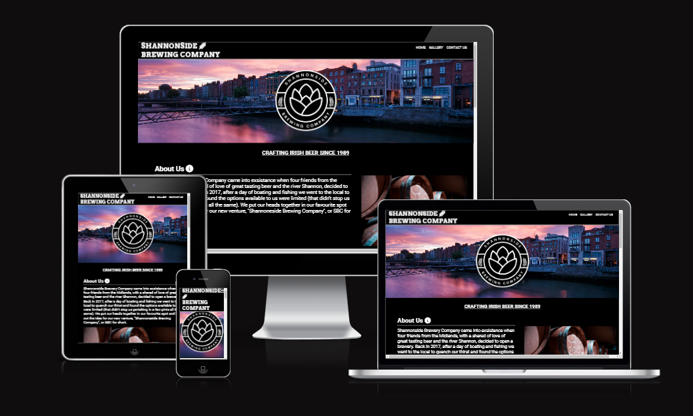
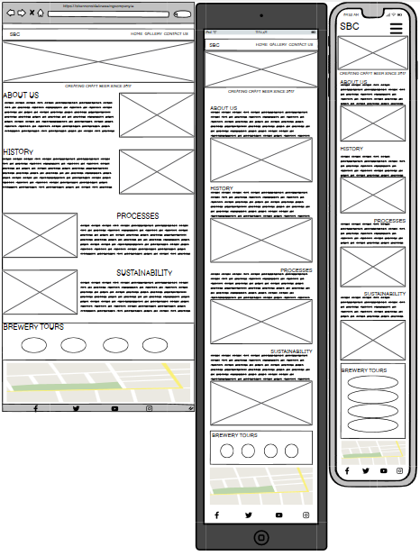
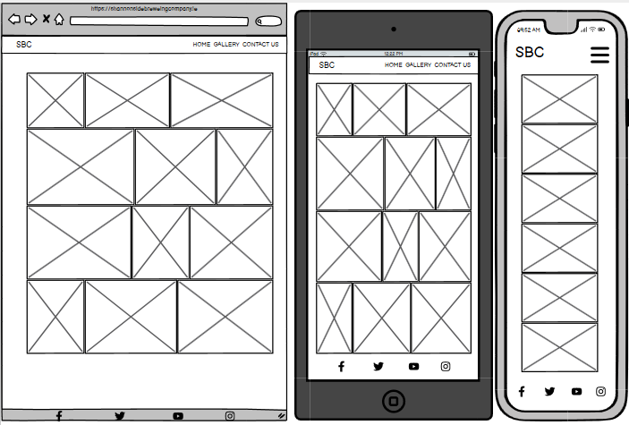
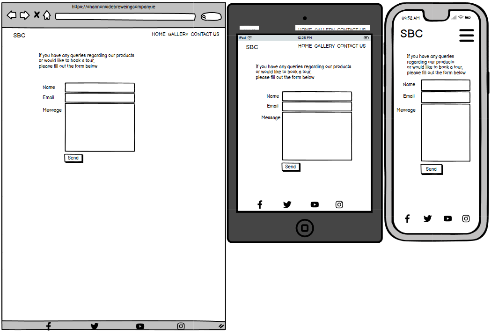
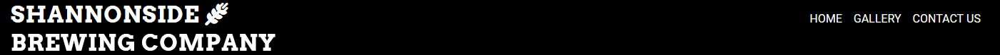
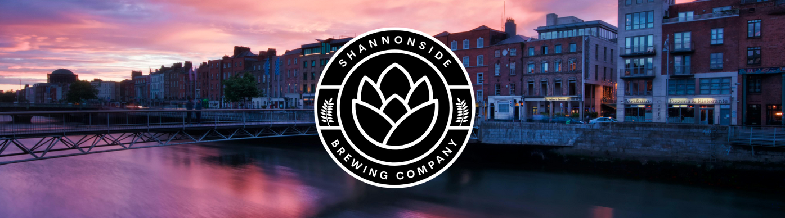
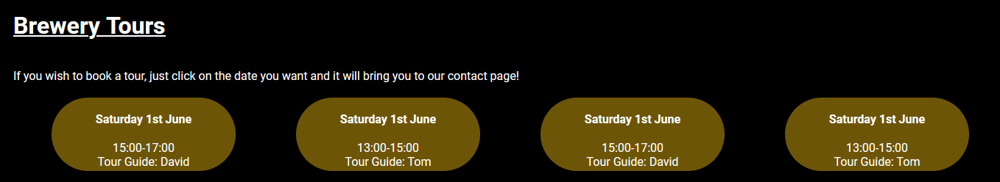

# Shannonside Brewing Company Website

[View the live website here](https://dimiclaff.github.io/pp1-shannonside-brewing-company/)

The Shannonside Brewing Company is a website advertising a fictional brewery on the banks of the river Shannon in Ireland.

## Contents

- [User Experiences](#user-experience)
    - Site Owner Goals
    - First Time Visitor Goals
    - Returning Visitor Goals

- [Design](#design)
    - Typography
    - Colour Scheme
    - Imagery
    - Wireframes

- [Features](#features)
    - Gerneral Features on Each Page
    - Future Implementations
    

- [Technologilies Used](#technologilies-used)
    - Languages Used
    - Frameworks, Libraries and Programs Used

- [Deployment](#deployment)
    - Deploying a Repository
    - Cloning a Repository
    - Forking a Repository

- [Testing](#testing)
    - HTML Validation
    - CSS Validation
    - Manual Testing
    - Accessibility
    - Performance

- [Credits](##Credits)
    - Code Used
    - Images
    - Acknowledgements

## User Experience
### Site Owner Goals
- To provide information to the visitor
- To provide a history of the brewery to the visitor
- To show the process and sustainability of the brewery
- To provide information on the brewerys tours
- To provide a place the visitor can contact the brewery

### First Time Visitor Goals
- To find information on the brewery
- To see when the brewery is open for tours
- To be able to contact the brewery
- To be able to easily navigate the site

### Returning Visitors Goals
- To be able to easily find information
- To be able to conytact the brewery
- To be able to see up to date information on tour details

## Design
### Typography
- The fonts used on the site are Roboto, Arvo and Cerebi. All are considered to be dyslexic friendly.
- Arvo is used on the brewery name on the top left of each page
- Cerebi is used on the logo
- Roboto is the man font used throughout the site

### Colour Scheme
The colour scheme used throughtout the website is a simple black and white, it matches the logo and portrays a sense of night time.

### Imagery
- The hero image at the top of the index page is of a city street along the banks of the river Shannon at sunset. It gives the feeling of Bohemian nightlife. 
- The other images on the index page use earthy tones which are in line with the natural ingredients used in the brewery.
- The gallery section shows some machinery and equipment used in the brewery along with employees and patrons of the tour.

### Wireframes

#### Index

 

#### Gallery

 

#### Contact Us

## Features
### General Features on Each Page
#### Nav Bar
- Featured on all pages
- The Nav Bar is fully responsive and on smaller screens it will change to a Hambuger icon with a functioning dropdown menu
- Allows users to easily navigate to all pages from all pages

#### Hero Image and Logo
- Image of a city street on the river Shannon. In the center of the image the Brewerys logo is centered.

#### Information Section
- This section provides information on the Brewery under the following headings.
    - About Us.
    - History.
    - Processes.
    - Sustainability.
- Under each heading is a paragraph of text providing information and an image organised into rows.
- On smaller screens the image is moved to under each heading.

#### Brewery Tours Section
- This section provides information on the upcoming rewery tours.
- It shows the next four available days.
- Each day shows the day, date, time and tour guide.
- Each day is a link which will bring the visitor to the "Contact Us" page.

#### Gallery Page
- This section show a collection of photos from the brewery
- This page is fully responsive to all screen sizes

#### Contact Us Page
- This page contains a functioning feedback and request form
- It requires the user to input a name
- It requires the user to input a functioning email address
- It allows the user to write a message to enquire about booking a tour or finding out more about the Brewery

#### Footer
- The footer is shown on all pages and is responsive to all screen sizes
- It contains functionng links to the Brewerys social media pages

### Future Implemantations
- A Store page
- A Review page

## Technologilies Used
### Frameworks, Libraries and Programs Used
- HTML was used to create the basic outline of the website
- CSS was used to style the website
- Canva was used to create the Logo
- Balsamiq was used to create the wireframes
- Google Fonts was used for the fonts, Arvo and Roboto
- FontAwsome was used for the icons
- Google Maps was used to show the map at the bottom of the index page

## Testing

### HTML Validation
#### No errors were found in the HTML validation

### CSS Validation
#### No errors were found in the CSS validation

      

### Manual Testing
 - Nav Bar
 - Brewery Tour Links
 - Social Pages Links
 - Form on Contact Us Page

 ### Known Bugs
 - At a screen width of 768px the Tour Guide names are sticking out of the bottom of the background
 - Form allows visitors to rogress without filling out all information

 #### All known bugs resolved

### Accesability
- xxxxxxxxxxxxxxxxxxxxxx
- xxxxxxxxxxxxxxxxxxxxxx
- xxxxxxxxxxxxxxxxxxxxxx

### Performance

## Credits 

### Images
#### All images were sourced from Pexels.com
- canning_machine_closeup by cottonbro studio
- employee_testing by cottonbro studio
- waitress_serving_beer by ELEVATE
- employee_smiling by ELEVATE
- employee_closing_vat by ELEVATE
- vat_long_view by ELEVATE
- canning_machine by cottonbro studio
- people_at_bar by ELEVATE
- employee_testing_colour by cottonbro studio
- hands_in_grain by cottonbro studio
- man_drinking_at_bar by Pavel Danilyuk
- two_people_laughing by ELEVATE
- about_us_pic by Arthur Brognoli
- hero_image by Steven Hylands
- history_image by Pixabay
- sustainability_image by Tom Fisk

### Code Used
- The code used for the map was taken from Google Maps by using the embed feature
- The code for wrapping the gallery pics was taken from [css-tricks-com](https://css-tricks.com/adaptive-photo-layout-with-flexbox/)

## Deployment
### Deploying a Repository
 The website was deployed using GitHub Pages by:
 1. Go to the GitHub Repository at https://github.com/dimiclaff/pp1-shannonside-brewing-company
 2. In the repository click on the settings tab located on the top of the page
 3. Click on the pages tab on the left hand side of the page
 4. Set Source to "Deploy from Branch"
 5. Make sure "Main Branch is selected
 6. Make sure folder is set to "/(root)
 7. Save

### Cloning a Repository
1. Go to the GitHub Repository at https://github.com/dimiclaff/pp1-shannonside-brewing-company
2. Click the green "Code" button on the right hand side of the screen, click HTTPs the copy the address underneath
3. Open a GitBash terminal and change the current working directory to the location where you want the cloned directory.
4. Type "git clone" then paste the URL youve copied.
5. Press Enter

### Forking a Repository
1. Go to the GitHub Repository at https://github.com/dimiclaff/pp1-shannonside-brewing-company
2. Click the fork button in the top right corner

### Acknowledgements
A big thank you to my mentor Mitko Bachvarov. He gave me a lot of good advice and encouragment. 